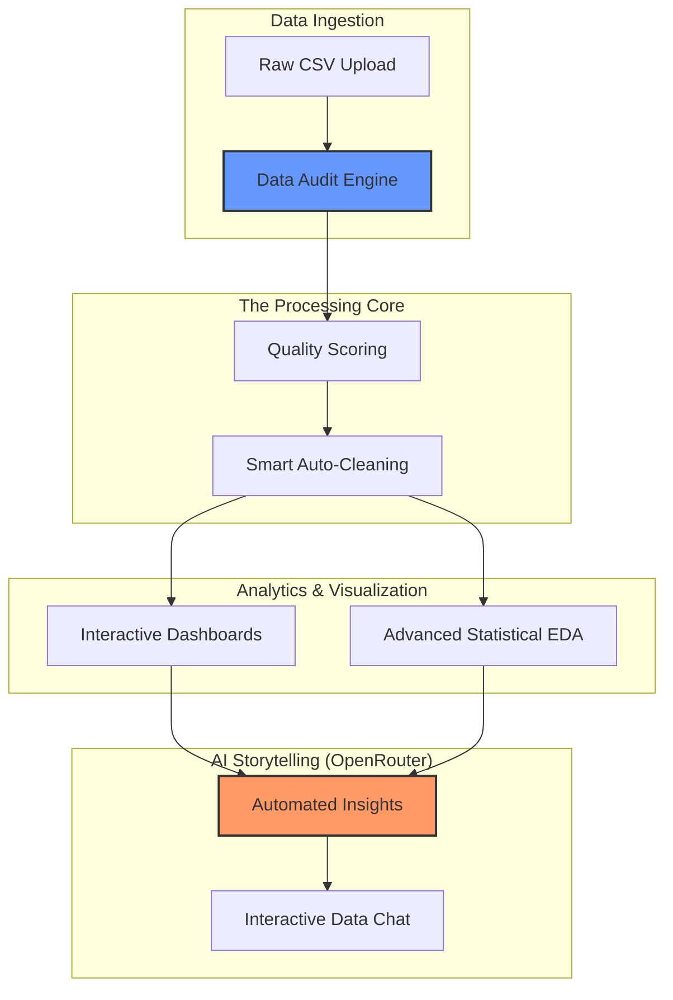

# 📊 InsightCanvas - AI-Powered Data Analytics Dashboard

An enterprise-grade, interactive data analysis platform that transforms raw CSV files into actionable insights. Built with **Streamlit**, **Plotly**, and **OpenRouter AI**, InsightCanvas handles everything from data auditing and auto-cleaning to advanced statistical visualizations and AI-powered storytelling.

---

## 🏗️ Technical Workflow



---

## 🚀 Key Modules

### 1. 📋 Data Audit & Quality Reporting
*   **Quality Scoring**: Real-time 0-100 score based on Completeness, Uniqueness, Consistency, and Outliers.
*   **Audit Metrics**: Detailed analysis of missing values, duplicates, and data type distribution.
*   **Actionable Insights**: Automated recommendations to improve your dataset's health.

### 2. 🧹 Smart Auto-Cleaning
*   **Missing Value Handling**: Strategies include row/column dropping, or imputation via Mean, Median, and Mode.
*   **Outlier Management**: Advanced detection using **IQR** or **Z-Score** methods with options to **Remove** or **Cap** values.
*   **Type Optimization**: Automated conversion of mixed-type columns to appropriate numeric or datetime formats.
*   **Before/After Comparison**: Interactive dashboard showing quality score improvements and impact logs.

### 3. 📉 Visualization Engine
*   **Interactive Core Charts**: Line, Bar, Scatter, Histogram, Box, and Pie charts powered by Plotly.
*   **Advanced EDA Suite**: 
    *   **Correlation Heatmaps** with automated "Strongest Relationship" detection.
    *   **Distribution Analysis** via subplots and **Kernel Density Estimation (KDE)**.
    *   **Statistical Grids**: Box plot grids, **Violin plots**, and **Scatter Matrices**.
    *   **Relationship Mapping**: High-performance **Pairplots** using Seaborn.

### 4. 🤖 AI Data Storytelling
*   **Automated Insights**: Instant narrative analysis of trends, patterns, and anomalies using **OpenRouter** (Llama 3.3).
*   **Chat with Data**: Ask natural language questions about your dataset and get precise, data-backed answers.

---

## 🛠️ Tech Stack

*   **Logic**: Python 3.12+
*   **Dashboard**: Streamlit
*   **Data Analysis**: Pandas, NumPy, SciPy
*   **Visualizations**: Plotly, Seaborn, Matplotlib
*   **AI Engine**: OpenRouter (OpenAI-compatible SDK)
*   **Environment**: uv (Package Management), python-dotenv

---

## 📋 Prerequisites

*   Python 3.12 or higher
*   [uv](https://docs.astral.sh/uv/) package manager
*   [OpenRouter API Key](https://openrouter.ai/keys)

---

## 🚀 Quick Start

### 1. Installation
```bash
# Clone the repository
git clone https://github.com/chauhan-varun/Insightcanvas.git
cd Insightcanvas

# Setup environment and install dependencies
uv sync
```

### 2. Configuration
Create a `.env` file in the root directory:
```bash
OPENROUTER_API_KEY=your_openrouter_key_here
AI_MODEL=meta-llama/llama-3.3-70b-instruct  # Optional
```

### 3. Running the Dashboard
```bash
uv run streamlit run app.py
```

---

## 📂 Project Structure

*   `app.py`: Main Streamlit application and layout.
*   `ai.py`: OpenRouter integration and AI logic.
*   `data_cleaner.py`: Data auditing, scoring, and automated cleaning pipelines.
*   `advanced_eda.py`: Statistical visualization engine.
*   `pyproject.toml`: Modern dependency management via `uv`.

---

## 🔧 Troubleshooting

### API Configuration
If the AI features are not responding, verify your environment variables:
```bash
echo $OPENROUTER_API_KEY
echo $AI_MODEL
```

### Dependency Issues
If you encounter import errors, ensure your environment is synced:
```bash
uv sync
```

---

## 📄 License
This project is open-source and available under the **MIT License**.

## 🤝 Contributing
Contributions are welcome! Please feel free to submit a Pull Request.

---
**Built with ❤️ for Data Scientists and Analysts.**
